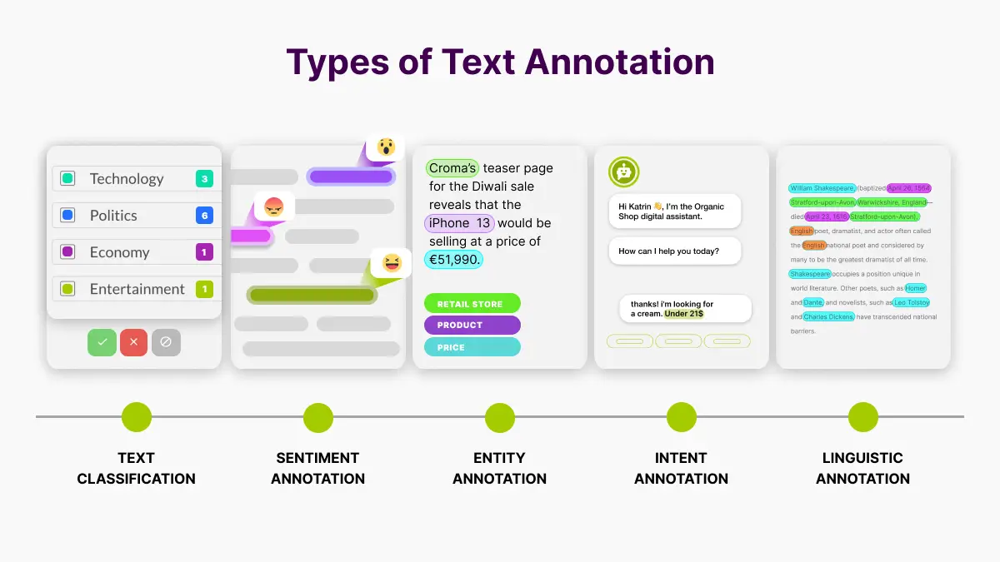
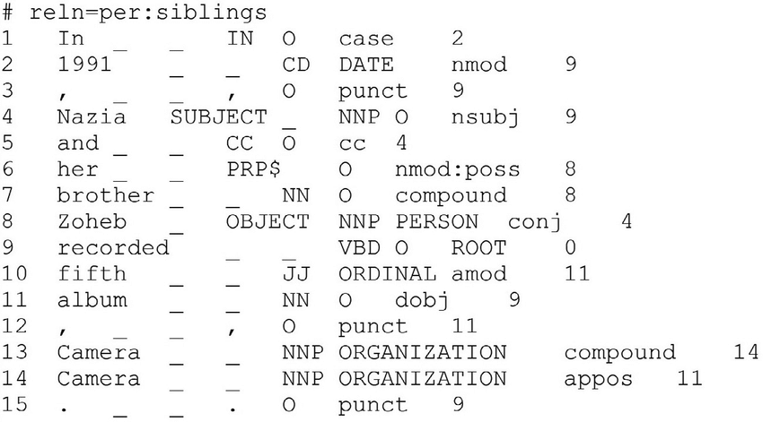
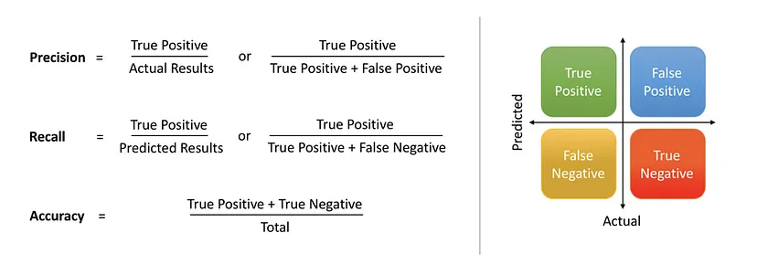

### Sugerencias de uso de la Notebook: 
-- Sugerimos 'Abrir en Colab' y realizar una copia del cuaderno antes de usarlo.

[](https://colab.research.google.com/github/chafa618/curso_anotacion_puan/blob/main/Clase3/clase3.ipynb)

# Clase 3:

## 📌 Aprendizaje supervisado vs. no supervisado

Cuando hablamos de AS y ANS, nos referimos a diferentes enfoques de aprendizaje automático. El aprendizaje automático estudia la construcción de modelos capaces de aprender
ciertas estructuras a partir de la información proporcionada por los datos. Es decir, el **aprendizaje automático se centra en encontrar patrones en los datos de tal forma que
podamos usar dichos patrones en puntos que no han sido observados previamente**


- **Aprendizaje supervisado**: El modelo aprende a partir de datos etiquetados, donde cada entrada tiene una salida asociada.
- **Aprendizaje no supervisado**: El modelo trabaja con datos no etiquetados, con el objetivo de descubrir patrones sin una salida específica.


<div style="text-align: center;">
    
</div>


### 📍 Aprendizaje Supervisado:
- Un algoritmo usa un conjunto de datos de muestra para entrenarse, hacer predicciones y ajustarse de forma iterativa para minimizar los errores. Estos datos están etiquetados con los valores de salida esperados, de forma tal que el modelo pueda dar una respuesta "acertada".
- Hay un conocimiento a priori que el modelo trata de aprender. Este tipo de algoritmo se centra en aprender la relaciones entre los datos de entrada y de salida (el dato y su etiqueta). 
- Es decuado para tareas de clasificación y regresión, como la previsión meteorológica, los cambios de precios, el análisis de opinión y la detección de spam.


### 📍 Aprendizaje No supervisado:
- El algoritmo se entrena con un conjunto de datos no etiquetados, es decir, sin una salida esperada. El objetivo del Unsupervised Learning es encontrar patrones, estructuras y relaciones en los datos sin la necesidad de una orientación o guía específica.
- No hay conocimiento a priori; el algoritmo recibe un conjunto de datos y busca patrones y similitudes por sí solo, sin que se le haya dicho de antemano qué características buscar e intenta agrupar los datos en función de similitudes y diferencias.
- Se utiliza ampliamente en el análisis exploratorio de datos y tareas de agrupación, detección de anomalías y reducción de dimensionalidad. 


|    | **Supervisado**                        | **No Supervisado**                    |
|--------------------|--------------------------------|--------------------------------|
| **Input**         | Dato etiquetado              | Dato crudo                    |
| **Output**        | Respuesta 'correcta' / etiqueta | Patrones                      |
| **Objetivo**      | Aprender relaciones entre los datos de entrada y de salida | Descubrir relaciones entre los datos sin etiquetar |
| **Tasks**         | Regresión, clasificación     | Exploración, agrupación       |
| **Ejemplo**       | Detección de spam, previsión meteorológica | Detección de anomalías, segmentación de clientes |


### 📝 Hagamos unos ejercicios:
1. Tenés un conjunto de datos con información de diferentes casas, incluyendo la cantidad de habitaciones, metros cuadrados, ubicación y precio de venta. Querés construir un modelo que, dado un conjunto de características de una casa nueva, prediga su precio.

2. Un negocio de comercio electrónico quiere agrupar a sus clientes en diferentes segmentos según su comportamiento de compra, sin una etiqueta predefinida. Se analizan datos como el número de compras realizadas, el monto gastado y la frecuencia de compra.

3. Un banco quiere identificar transacciones sospechosas analizando patrones inusuales en el comportamiento de los clientes. No tiene ejemplos previos de fraude etiquetados, pero quiere detectar anomalías basadas en las transacciones habituales de cada cliente.

4. Un sistema de correo electrónico tiene un conjunto de datos con correos etiquetados como "spam" o "no spam". Querés entrenar un modelo para clasificar automáticamente nuevos correos en una de estas dos categorías.


## 📌 Tareas de Clasificación y Regresión

La **clasificación** es un método de machine learning supervisado en el que el modelo intenta prever la etiqueta correcta de unos datos de entrada dados. En este caso, el modelo se entrena con un dataset de entrenamiento y, luego, se evalúa con los datos de prueba* con el objetivo de realizar predicciones sobre nuevos datos no vistos durante el entrenamiento. 
Hablamos de una tarea de **clasificación** cuando la variable objetivo es discreta. Por ejemplo, el analisis de sentimiento. 

Por otro lado, cuando la variable objetivo es continua estamos frente a un caso **regresión**. Un ejemplo puede ser la previsión del salario de una persona dados su nivel de estudios, su experiencia laboral, su ubicación geográfica y su antigüedad.

<div style="text-align: center;">
    
</div>


Si pensamos en el **analisis de sentimientos**, el objetivo central consiste en predecir a qué **clase** pertenece un texto dado, que no hemos visto durante la fase de entrenamiento. Siendo dichas clases "Positivo", "Negativo" y/o "Neutro". 

En cambio, si nos centramos en **predecir el precio del alquiler** de los dptos en CABA estamos hablando de un valor continuo en función de las variables de entrada. El objetivo principal de los problemas de regresión es estimar una función de mapeo en función de las variables de entrada y salida.


### 🔹 Ejercicio

Identificar:
- Problema a resolver
- Tipo de output variables (continuo | categórico)
- De que tipo de problema estamos hablando en cada caso?


<div style="text-align: center;">
    
</div>

### ⚠️ Pero, pero pero... 

Sea cual fuere la tarea a la que nos enfrentemos, necesitaremos datos

## 📌 Datos Estructurados vs. No Estructurados en Machine Learning

En el ámbito del machine learning, es crucial entender la diferencia entre datos estructurados y no estructurados, ya que esto influye en cómo se procesan y utilizan para entrenar modelos.

### 🔹 Datos Estructurados
Los datos estructurados son aquellos que están organizados en un formato predefinido, como tablas en bases de datos relacionales. Estos datos tienen un esquema fijo con filas y columnas, donde cada columna representa una característica específica y cada fila una instancia de datos. Ejemplos comunes incluyen hojas de cálculo y bases de datos SQL.

*Ejemplo*: Un dataset de ventas con columnas como `Fecha`, `Producto`, `Cantidad`, y `Precio`.

### 🔹 Datos No Estructurados
Los datos no estructurados no tienen un formato predefinido y no se ajustan fácilmente a un modelo tabular. Estos datos pueden incluir texto, imágenes, audio, video, y otros tipos de contenido multimedia. Debido a su naturaleza, requieren técnicas especiales para ser procesados y analizados.

*Ejemplo*: Correos electrónicos, publicaciones en redes sociales, imágenes y videos.

La anotación de datos permite que los datos no estructurados se conviertan en datos estructurados, facilitando su uso en modelos de machine learning y mejorando la precisión y efectividad de estos modelos.


## 📌 Anotación
- La anotación de contenidos constituye un paso esencial para convertir datos crudos en recursos utilizables o que un algoritmo puede consumir. 
- Consiste en etiquetar y organizar los datos. 
- La tarea de anotación puede ser realizada manualmente por anotadores humanos o automáticamente mediante técnicas algorítmicas (con resultados más o menos convincentes). Aunque, a menudo es necesaria la supervisión humana para comprobar y corregir una anotación de datos con el fin de garantizar su fiabilidad.
- Este proceso requiere tanto de precisión como de una comprension profunda del contexto de los datos, ya que la calidad de las anotaciones determina en gran medida la capacidadd de los algoritmos de generalizar a partir de los datos. 
- Un **dataset** es, justamente, un conjunto de datos (que puede o no estar etiquetado) recopilado con un fin específico.
- Las anotaciones de datos se usan tanto para crear datasets de entrenamiento, validación y de prueba. 
- Estos conjuntos de datos se utilizan para medir el rendimiento del modelo (validación y prueba)

### ✏️ Anotación de Imágenes

<div style="text-align: center;">
    
</div>


### ✏️ Anotación de Textos

<div style="text-align: center;">
    
</div>

### 
- Anotación de entidades y dependencias
<div style="text-align: center;">
    
</div>


- Anotación Connlu
<div style="text-align: center;">
    
</div>


## 📌 Métricas para evaluar modelos de clasificación

- **Accuracy** (certeza): (Predicciones correctas / Total de predicciones).
- **Precisión**: (Verdaderos Positivos / (Verdaderos Positivos + Falsos Positivos)).
- **Recall** (cobertura): (Verdaderos Positivos / (Verdaderos Positivos + Falsos Negativos)).


<div style="text-align: center;">
    
</div>

### Recursos:
- [Documentación SkLearn](https://scikit-learn.org/stable/auto_examples/model_selection/plot_precision_recall.html)

## 📌 Precisión vs. Cobertura en Aprendizaje Automático
Cuando evaluamos un modelo de clasificación, es importante entender dos métricas clave: precisión (*precision*) y cobertura (*recall*). 
Ambas nos ayudan a medir qué tan bien está funcionando nuestro modelo, pero desde perspectivas diferentes.

#### 🔹 Precisión (Precision)
La precisión se refiere al porcentaje de predicciones positivas que realmente son correctas. En otras palabras, mide cuántos de los resultados identificados como positivos por el modelo son realmente relevantes.

 📍 *Ejemplo*: Si un detector de spam identifica 100 correos como spam, pero solo 80 realmente lo son, la precisión sería del 80%.

### 🔹 Cobertura (Recall)
  La cobertura mide el porcentaje de los casos realmente positivos que el modelo detectó correctamente. Es decir, nos dice qué tan bien el modelo encuentra todos los casos relevantes dentro del total existente.

 📍 *Ejemplo*: Si en tu bandeja de entrada hay 120 correos de spam y el modelo detectó solo 80, la cobertura sería del 80/120 = 66.6%.

### 📊 Diferencia clave entre precisión y cobertura
- Un modelo con **alta precisión pero baja cobertura** es muy estricto: solo etiqueta como positivos los casos en los que está muy seguro, pero puede dejar muchos sin detectar.
- Un modelo con **alta cobertura pero baja precisión** etiqueta muchos casos como positivos, incluyendo algunos que no lo son (*falsos positivos*).
- El *equilibrio entre precisión y cobertura* depende de la aplicación. En un detector de fraudes, preferimos alta precisión (evitar falsos positivos), pero en un diagnóstico médico, priorizamos alta cobertura (detectar la mayor cantidad de casos).

### 📌 F1-score: Equilibrando Precisión y Cobertura
En la mayoría de los problemas de clasificación, podemos dar mayor prioridad a precisión (precision) o a cobertura (recall), dependiendo del contexto. 

Sin embargo, en muchos casos necesitamos una métrica que combine ambas y nos dé una visión equilibrada del rendimiento del modelo.

Esa métrica es el F1-score, que es la media armónica entre precisión y cobertura.

#### 🔹 ¿Por qué usar F1-score?
Si sólo usamos precisión, podríamos obtener un modelo que solo predice lo que está muy seguro, dejando fuera muchos casos positivos reales.
Si, en cambio, nos concentramos solo en la recall o cobertura, podríamos tener un modelo que clasifica demasiados ejemplos como positivos, generando muchos falsos positivos.

El F1-score nos permite encontrar un balance entre ambas métricas.

#### 📊 Cálculo del F1-score
Se define con la siguiente fórmula:

<div style="text-align: center;background-color: white;">
    
</div>
 
Esta es la media armónica entre precisión y cobertura.

 🔹 **Para tener en cuenta: El F1-score solo será alto si ambas métricas son altas. Si una es muy baja, el F1-score también será bajo.**


Por suerte para nosotros, o no, este tipo de métricas ya están implementadas y dicha implementacion no será vista en este curso. Por esto mismo, utilizaremos algunas de las herramientas provistas por librerías existentens. 


```python
from sklearn.metrics import accuracy_score, precision_score, recall_score, f1_score

resultado_esperado = ["SPAM", "NO_SPAM", "SPAM", "SPAM", "NO_SPAM", "SPAM"]
resultado_obtenido = ["SPAM", "NO_SPAM", "SPAM", "NO_SPAM", "NO_SPAM", "SPAM"]

y_true = [1, 0, 1, 1, 0, 1] 
y_pred = [1, 0, 1, 0, 0, 1]

print("Accuracy:", accuracy_score(y_true, y_pred))
print("Precisión:", precision_score(y_true, y_pred))
print("Cobertura:", recall_score(y_true, y_pred))
print("F1-score: ", f1_score(y_true, y_pred))
```
