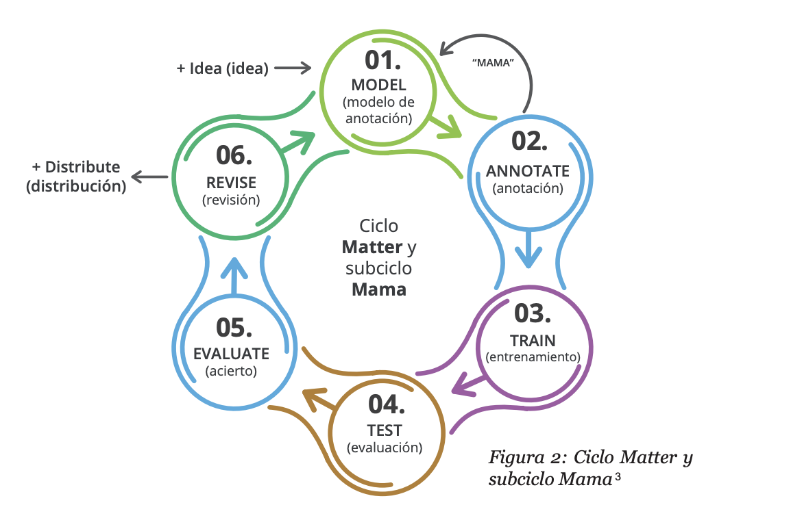

# Guía de anotación de entidades: diseño, criterios y flujo de trabajo


## 1. ¿Por qué anotar entidades?

- **Objetivo de la tarea** – ¿qué queremos que aprenda el modelo o qué preguntas de investigación queremos contestar?
- **Dominio** – lenguaje jurídico, médico, financiero, redes sociales, etc.; cada dominio necesita un inventario de entidades distinto.
- **Uso ulterior** – extracción de información, RAG, o enriquecimiento de buscadores.

> Definir claramente el “para qué” evita sobre‑anotar o pasar por alto categorías cruciales.

---

## 2. Pasos para definir el inventario de entidades

Objetivo primario: "Identificar los destinos los destinos más frecuentemente usados y las aerolineas que operan allí."

| Paso                      | Pregunta                           | Resultado esperado             | Ejemplo (ticket aéreo)                                                                     |
| ------------------------- | ------------------------------------------ | ------------------------------ | ------------------------------------------------------------------------------------------ |
| 1. Revisión corpus piloto | ¿Qué conceptos se repiten y aportan valor? | Lista preliminar de candidatos | “EZE”, “LATAM”, “Economy Flex”                                                             |
| 2. Filtro de relevancia   | ¿Sirven al objetivo?                       | Lista depurada                 | LATAM ✓ / lunes ✗                                                                          |
| 3. Agrupación semántica   | ¿Hay solapamientos?                        | Taxonomía jerárquica           | `COMPANY` ⊃ `AIRLINE`                                                                      |
| 4. Definición operacional | ¿Cuándo una mención **es** entidad?        | Descripción concreta           | `AIRPORT`: cualquier código IATA o nombre oficial de un aeropuerto comercial               |
| 5. Ejemplificación        | ¿Cómo se ve in‑situ?                       | Ejemplos + contraejemplos      | llego a **EZE**, viajo a **Ezeiza**, pero *no* voy a **Buenos Aires** (demasiado genérico) |

---

## 3. Criterios de anotación (reglas del juego)

1. **Unidades léxicas**: *span* mínimo que preserve significado (por ejemplo `Banco Santander Río` completo).
2. **Inclusión/Exclusión**: incluir artículos o adjetivos solo si distinguen (`La Rioja` vs. `Rioja` vino).
3. **Normalización interna**: tildes y mayúsculas **no** alteran la anotación; se anota tal cual aparece.
4. **Entidades anidadas**: decidir si se permiten (`Hospital de Clínicas José de San Martín` → `HOSPITAL` que contiene `PERSON`).
5. **Ambigüedad contextual**: se anota según contexto (Despegar = `COMPANY` salvo que sea la descripción de una acción).
6. **Desconocidos**: etiqueta `OTHER`/`MISC` para no forzar clasificaciones espurias.
7. **Formato de etiquetas**: BIO, IOB2 o BILOU


---

## 4. Guía de anotación: estructura mínima

1. **Introducción y propósito**
2. **Listado de etiquetas y definiciones formales**
3. **Ejemplos positivos y negativos** (3‑5 cada uno)
4. **Casos límite y resolución**
5. **Procedimiento de anotación**
   - Práctica de deshacer/corregir
6. **Control de calidad**
   - Muestreo + resolución de conflictos
   - Métrica de acuerdo inter‑anotador (κ, F1, etc.)
7. **Historial de cambios / versionado**


---
## Metodo Matter
<div style="text-align: center;">
    
</div>

---

## 5. Ejemplo (fragmento en BIO)

```text
B-CLIENTE  I-CLIENTE  B-ACCION        B-PRODUCTO  I-PRODUCTO  O
María      Gómez      compró          un          pasaje       aéreo
```

- `María Gómez` → `CLIENTE` completo, nombre + apellido.
- Verbo transaccional separado como `ACCION` (opcional según objetivo).
- `pasaje aéreo` tratado como unidad semántica dentro de `PRODUCTO`.

---

## 6. Herramientas y flujo de trabajo

1. **Plataformas populares**
   - *[Doccano](https://github.com/doccano/doccano)* (web, open‑source)
   - *Prodigy* (bajo licencia)
   - *INCEpTION* (anidación avanzada)
2. **Pipeline sugerido**
   1. Corpus piloto → definir etiquetas.
   2. Sesión de *trial annotation* (2‑3 personas, 100 ejemplos).
   3. Revisión de divergencias → pulir guía.
   4. Anotación en bloques (\~500 instancias) con control iterativo.
   5. Exportación (JSONL / CoNLL‑2003 / SpaCy DocBin).
3. **Automatización**
   - Scripts de validación y cálculo de IAA (`sklearn.metrics`).

---

## 7. Indicadores de éxito

| Indicador            | Meta razonable         | Consejos                                    |
| -------------------- | ---------------------- | ------------------------------------------- |
| κ de Cohen / Fleiss  | ≥ 0.80                 | Re‑entrenar anotadores si < 0.70            |
| Cobertura            | ≥ 95 % menciones clave | Corpus piloto amplio y diverso              |
| Tiempo por documento | < 2 min                | Atajos de teclado, anotación semiautomática |

---

## 8. Discusión

- ¿Qué hacer cuando emergen nuevas entidades durante la anotación?
- ¿Cómo balancear granularidad vs. coste?
- ¿Permitir entidades discontinuas? (por ejemplo `Apple … Inc.`)
- Ética y privacidad: anonimizar datos sensibles.

---


